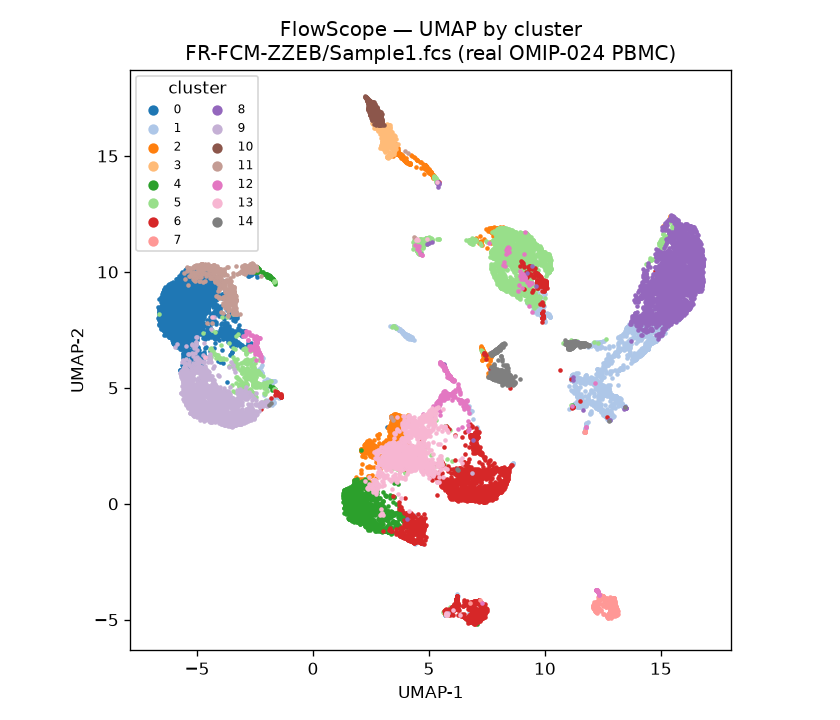
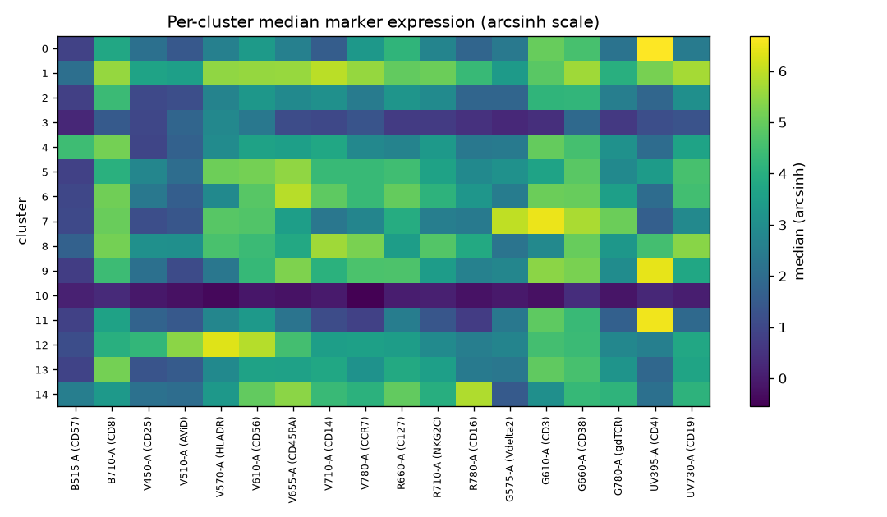
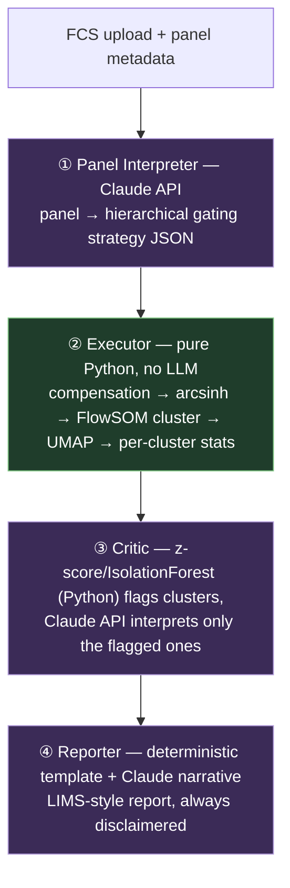

# FlowScope

FlowScope automates gating of flow cytometry data, flags cell populations that are
statistically anomalous relative to the rest of a sample, and uses an AI agent to
give a first-pass read on whether an anomaly looks like a technical artifact or a
biologically real population — with the marker evidence for that read spelled out
so an analyst can check it.

## Screenshots

FlowSOM-style clustering of a real OMIP-024 PBMC sample (FR-FCM-ZZEB, `Sample1.fcs`,
428,831 events → 20k subsampled → 15 metaclusters), shown in the Streamlit UI:

| UMAP by cluster | Per-cluster marker heatmap |
|---|---|
|  |  |

Regenerate with `python scripts/make_figures.py` (falls back to the synthetic
fixture if the real data isn't present). The heatmap's uniformly-dark row is the
low-everything cluster the anomaly detector flags as a likely dead-cell/debris
population — exactly the kind of thing the Critic agent then interprets.

## Scope and limitations (read this first)

**FlowScope is a research, education, and portfolio project. It is not a clinical
diagnostic tool**, has not been validated for clinical use, and must not be treated
as one. Nothing in this codebase should ever produce a definitive diagnostic claim
(e.g. "this sample has condition X"). Every interpretive output is phrased as a
**reference signal that requires expert review** — the AI agent proposes, a trained
analyst decides.

## Why this project exists

I worked as a flow cytometry / cell-based-assay analyst at a cell-therapy CRO
(iQ Biosciences), running γδ T-cell expansions, PBMC/lymphocyte isolation,
multicolor flow cytometry on a FACSCalibur, and cytotoxicity bioassays
(ADCC/TDCC/CBA). A recurring part of that work was staring at a cluster or gate
that looked "off" and having to reason — from marker expression, not gut feeling —
about whether it was compensation spillover, a dying-cell artifact, or something
real worth flagging. FlowScope is an attempt to encode that reasoning step as a
tool an actual analyst could sanity-check, not a black box.

That bench experience shaped specific design decisions:

- **The LLM never clusters.** At the bench, the numbers (compensation matrix,
  transform, gating) are where errors are catastrophic and reproducibility is
  non-negotiable, while the "is this real or an artifact?" call is the genuinely
  judgment-heavy part. So the deterministic ML does all the math and the LLM is
  confined to the interpretation step — the same division of labor a lab already
  uses between an instrument/software and the analyst reading the plots.
- **Every AI output is framed for review, never as a verdict.** Real analysts
  don't trust a black box; they trust a colleague who shows their reasoning. The
  Critic is prompted to argue from marker evidence and to say "needs confirmation"
  rather than guess, and the report always carries the analyst-review disclaimer.
- **Debris/dead-cell and spillover artifacts are first-class hypotheses.** Those
  are the artifacts you actually chase on a real instrument, so the Critic's
  prompt names them explicitly rather than treating every anomaly as biology.

## Data source

**Accession: [FR-FCM-ZZEB](https://flowrepository.org/id/FR-FCM-ZZEB)** —
OMIP-024, "Pan-leukocyte immunophenotypic characterization of PBMC subsets in
human samples" (Moncunill et al., 2014, *Cytometry Part A*).

- 18-color panel: CD3, CD4, CD8, CD19, CD14, CD56, CD16, γδTCR, Vδ2, CD25, CD127,
  CD45RA, CCR7, CD57, HLA-DR, CD38, NKG2C, viability dye.
- PBMC samples (healthy and HIV+ US adults in the original panel-development
  cohort).
- Chosen because it's real PBMC (not whole blood) and covers all of the
  T/B/NK lineage markers (CD3/CD4/CD8/CD19/CD56) FlowScope's first gating pass
  targets, even though its 18 colors exceed the simpler 8–14 color panel this
  project originally scoped for.

**Note:** `flowrepository.org`'s TLS certificate expired back in March 2023 (confirmed
via `openssl s_client`), so direct browsing initially required bypassing certificate
validation. The page itself confirmed public, no-login access for *viewing* the
experiment — but actually **downloading** the FCS files is gated (bulk ZIP requires
a CAPTCHA, individual file links redirect to `/login`), neither of which Claude Code
performs autonomously. **The real data was manually downloaded by the user** and now
lives at `data/raw/FR-FCM-ZZEB/` (git-ignored, ~395MB — not committed):

- `743705.fcs`–`743723.fcs` — single-stain compensation controls (19 files)
- `Sample1.fcs`, `Sample2.fcs` — the actual 18-color PBMC-stained specimens
  (428,831 and 374,517 events respectively), each with an embedded spillover
  matrix and named markers (CD3, CD4, CD8, CD19, CD56, CD14, CD16, CD25, CD38,
  CD57, CD45RA, CCR7, HLA-DR, NKG2C, γδTCR, Vδ2, CD127, viability dye)

FCS parsing uses a pure-Python library (`flowio`) so the project has no
R/Bioconductor dependency and stays easy to deploy.

### Synthetic placeholder data

`scripts/generate_synthetic_fcs.py` generates a synthetic 10-color PBMC-like
FCS file (`data/raw/synthetic_pbmc_demo.fcs`) with a known ground-truth spillover
matrix, used to build and validate the parsing/compensation/transform pipeline
before real data was available, and kept as a fast, git-trackable regression
fixture (`tests/test_executor.py` uses it for the main test suite; a separate
set of tests runs against the real `Sample1.fcs` when present, but is skipped
otherwise since the real data isn't committed).

## Architecture

Deterministic computation (compensation, transforms, clustering) and LLM
judgment are kept strictly separate. The LLM is only invoked at the points where
a human analyst's judgment call is actually needed — never for the clustering
itself.



Purple = LLM stages (①③④), green = deterministic (②). Text version:

```
[FCS upload + panel metadata]
        │
        ▼
① Panel Interpreter (Claude API)
   - reads the marker/fluorochrome panel, proposes a hierarchical gating strategy
   - output: list of {step, marker_pair, gate_type, rationale} (JSON)
        │
        ▼
② Executor (pure Python, no LLM call)
   - compensation → arcsinh transform
   - FlowSOM-style clustering (SOM + consensus metaclustering) + UMAP
   - per-cluster marker expression summary statistics
        │
        ▼
③ Critic / anomaly interpreter (Claude API)
   - IsolationForest / z-score flags anomalous clusters by frequency (Python)
   - LLM is called only on flagged clusters: artifact vs. biologically
     meaningful, argued from marker expression, "needs confirmation" when unsure
        │
        ▼
④ Reporter (Claude API, template-based)
   - turns the above into a structured, LIMS-entry-style report
   - always includes: "AI-proposed; final review performed by the analyst"
```

Only stages ①③④ call the Claude API (Anthropic Python SDK). Stage ② is pure
Python with no LLM involvement — clustering and dimensionality reduction are
deterministic, not delegated to a language model.

**Why FlowSOM-style over scanpy+Leiden:** OMIP-024 samples have 300k–400k+
events each. A Leiden partition on a KNN graph of that many cells is slow and
memory-heavy, whereas a self-organizing map scales cheaply and is the method
flow cytometrists actually use (FlowSOM). See `src/flowscope/clustering.py`.

## Running

### Quickest — one command

```bash
git clone https://github.com/Yimstin95/Flowscope.git
cd Flowscope
./run.sh
```

`run.sh` finds its own location, creates the `.venv` and installs dependencies on
first run only, generates the synthetic demo FCS fixture if no data is present yet,
and starts Streamlit. Safe to re-run any time — later runs just reuse the existing
`.venv`. It also works if you already have the repo cloned somewhere else, or opened
as a subfolder inside a larger workspace: run it as an absolute path
(`/path/to/Flowscope/run.sh`) from anywhere and it still resolves correctly.

### From VS Code, without navigating to the folder

If this repo lives inside a larger multi-project VS Code workspace (as it does for
the original author, under `Biotechnology/FlowScope/`), a workspace-level task runs
it with no `cd` and no folder-switching:
**⇧⌘B** (macOS) / **Ctrl+Shift+B** (Windows/Linux) → runs the **"FlowScope: Run"**
task from `.vscode/tasks.json` at the workspace root. Or Command Palette →
**Tasks: Run Task** → **FlowScope: Run**.

### Manual setup (equivalent to `run.sh`, spelled out)

```bash
git clone https://github.com/Yimstin95/Flowscope.git
cd Flowscope
python3 -m venv .venv && source .venv/bin/activate
pip install -r requirements.txt
pip install -e .                 # editable install so `import flowscope` resolves
cp .env.example .env             # add your own ANTHROPIC_API_KEY (git-ignored; never commit)
python3 scripts/generate_synthetic_fcs.py   # synthetic data/raw/*.fcs fixture
pytest tests/ -v                 # real-data tests auto-skip if data/raw/FR-FCM-ZZEB/ is absent

streamlit run streamlit_app.py   # UI: cluster → UMAP/heatmap → anomaly detection → report
```

The Streamlit app runs the deterministic pipeline (clustering, UMAP, heatmap,
frequencies) and the deterministic anomaly detection with no key required. The AI
report — stage-3 interpretation of flagged clusters plus the stage-4 narrative — is
opt-in behind a button and enabled when `ANTHROPIC_API_KEY` is set (read from the
git-ignored `.env`, or from Streamlit secrets when deployed); a "build report
without AI" fallback produces the deterministic report regardless.

### Deploying a public link (Streamlit Community Cloud)

Anyone with the repo pushed to GitHub can get a shareable `https://*.streamlit.app`
URL, free, with zero local setup for viewers:

1. Go to [share.streamlit.io](https://share.streamlit.io) and sign in with GitHub.
2. **Create app** → pick this repo, branch `main`, main file path `streamlit_app.py`.
3. Before deploying, open **Advanced settings → Secrets** and paste:
   ```toml
   ANTHROPIC_API_KEY = "sk-ant-..."
   ```
   (Only needed if you want the AI report button to work for viewers — the
   deterministic sections work with no secret at all.)
4. Deploy. First boot auto-generates the synthetic demo data (the real,
   git-ignored FR-FCM-ZZEB sample isn't in the repo, so the public deployment
   runs on synthetic data unless you separately host the real FCS files
   somewhere the app can fetch them).

This step needs your own GitHub/Streamlit login, so it can't be done for you —
the four steps above are the whole thing.

The two LLM prompts can also be validated standalone (both need a funded
`ANTHROPIC_API_KEY`):

```bash
python scripts/validate_panel_interpreter.py   # stage 1 across several panels
python scripts/validate_critic.py              # stages 3 end-to-end on a real sample
```

### How the code maps to the pipeline

| Stage | Module | LLM? |
|---|---|---|
| ① Panel Interpreter | `src/flowscope/panel_interpreter.py` | yes (`claude-sonnet-4-6`) |
| ② Executor — parse/compensate/transform | `src/flowscope/executor.py` | no |
| ② Executor — cluster/UMAP/summary | `src/flowscope/clustering.py` | no |
| ② pipeline composition | `src/flowscope/pipeline.py` | no |
| ③ Critic — detection + interpretation | `src/flowscope/critic.py` | detection no, interpretation yes |
| ④ Reporter | `src/flowscope/reporter.py` | narrative only |
| UI | `streamlit_app.py` | — |

## Status

- [x] Repo scaffolding + accession selection
- [x] FCS parsing + compensation/transform (`src/flowscope/executor.py`) —
      validated against both the synthetic fixture and the real FR-FCM-ZZEB
      `Sample1.fcs`/`Sample2.fcs` (manually downloaded; embedded 18×18
      spillover matrix, all 18 OMIP-024 markers confirmed present)
- [x] Clustering + UMAP visualization (`src/flowscope/clustering.py`,
      `pipeline.py`, `streamlit_app.py`) — FlowSOM-style SOM + consensus
      metaclustering, UMAP, per-cluster summary; verified in the Streamlit UI
      on real Sample1.fcs (428,831 events → 15 metaclusters)
- [x] Panel Interpreter agent (`src/flowscope/panel_interpreter.py`) — stage-1
      Claude call (model pinned to `claude-sonnet-4-6`); forces structured JSON
      via tool use (`tool_choice`); returns an ordered list of
      `{step, marker_pair, gate_type, rationale}` gating steps. Unit-tested with
      a fake client (no key/network); live-validate the prompt across panels
      with `python scripts/validate_panel_interpreter.py` (needs
      `ANTHROPIC_API_KEY`)
- [x] Critic / anomaly-interpretation agent (`src/flowscope/critic.py`) —
      deterministic anomaly detection (frequency z-score + IsolationForest over
      the per-cluster feature vector, no LLM) plus the stage-3 Claude call that
      interprets only flagged clusters as artifact-vs-biological (forced tool
      use; prompted to prefer "needs confirmation" under uncertainty). Detection
      verified on real Sample1.fcs (flags the debris/dead-cell cluster);
      unit-tested with a fake client; live-validate end-to-end with
      `python scripts/validate_critic.py` (needs `ANTHROPIC_API_KEY`)
- [x] Reporter (`src/flowscope/reporter.py`) — stage-4: a deterministic
      template assembles the LIMS-style report (sample/analysis parameters,
      cluster-frequency table, flagged clusters + interpretations) and always
      appends the "AI-proposed; analyst reviews; not diagnostic" disclaimer;
      the Claude call writes only the narrative summary. Wired into the
      Streamlit UI (anomaly-detection section always shown; AI report gated
      behind `ANTHROPIC_API_KEY`, with a deterministic "build without AI"
      fallback + Markdown download). Verified end-to-end in the browser on
      real Sample1.fcs
- [x] README finalization — screenshots (`docs/`, `scripts/make_figures.py`),
      Mermaid architecture diagram, code map, and the limitations section below

## Limitations

Beyond the top-line "not a diagnostic tool" scope, the specific methodological
caveats a reviewer should know:

- **Subsampling.** Clustering and UMAP run on a random subsample (default 20k
  events) for tractability. Frequencies are unbiased estimates but rare
  populations below the subsample's resolution can be missed; results shift
  slightly with the seed.
- **Metacluster count is a knob, not a truth.** The number of populations
  (default 15) is a parameter, not a biological ground truth — over/under-
  clustering is possible and is left to the analyst to judge.
- **arcsinh cofactor is fixed by default.** A single cofactor (~150) is applied
  to all fluorescence channels; per-channel tuning or logicle would be more
  faithful for some markers.
- **Gating strategy is not executed.** Stage ① *proposes* a gating hierarchy; the
  pipeline does not yet apply those gates — clustering is independent of the
  suggested strategy. Wiring the proposed gates into the analysis is future work.
- **Anomaly thresholds are heuristics.** The z-score cutoff and IsolationForest
  contamination are defaults, not validated operating points; they flag *candidates*
  for review, and both false positives and misses are expected.
- **LLM outputs are non-deterministic and unverified.** The Panel Interpreter and
  Critic can be wrong or inconsistent between runs. Nothing downstream trusts them
  automatically — they are reference signals for an analyst, and the report says so.
- **Compensation uses the embedded spillover matrix as-is.** FlowScope does not
  recompute spillover from the single-stain controls (`743705`–`743723`); a wrong
  or stale embedded matrix would propagate.
- **Single-sample only.** There is no cross-sample batch correction or
  cohort-level comparison; each file is analyzed on its own.
